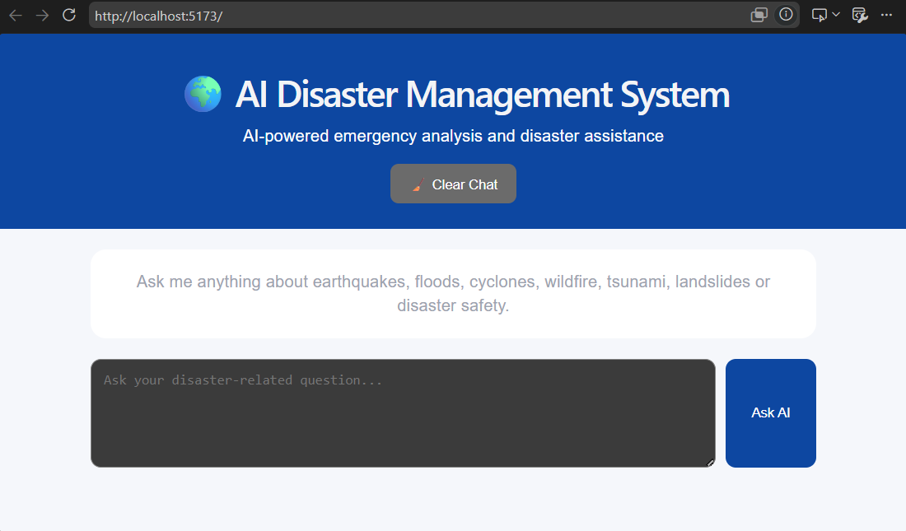
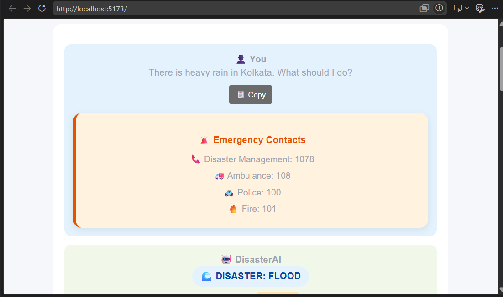
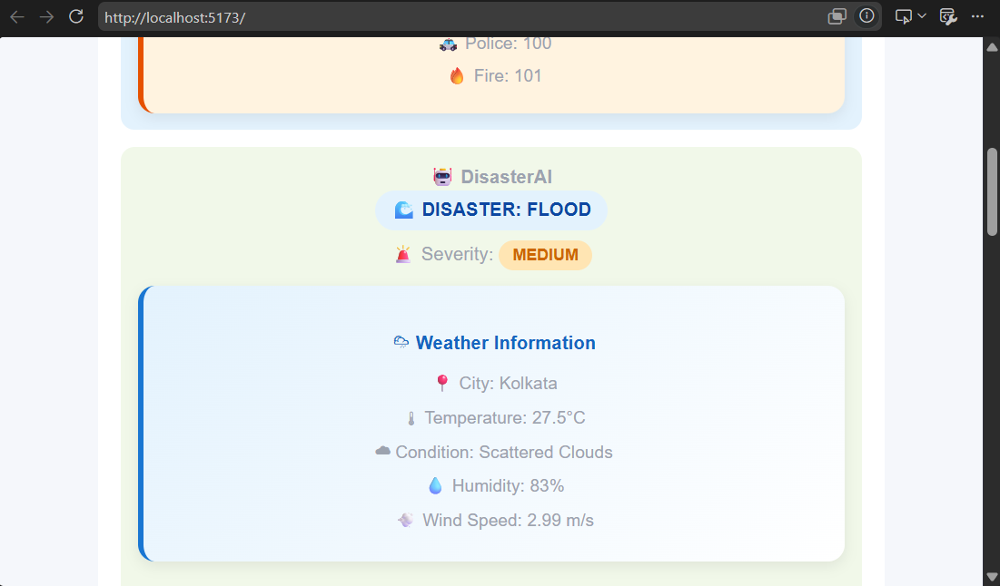
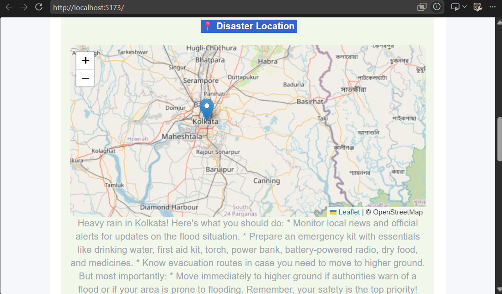
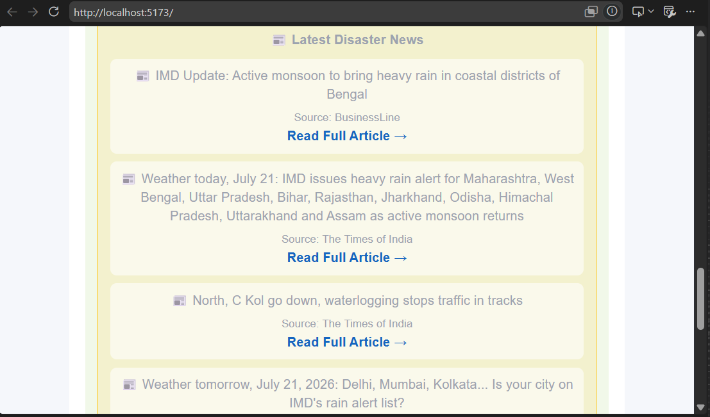
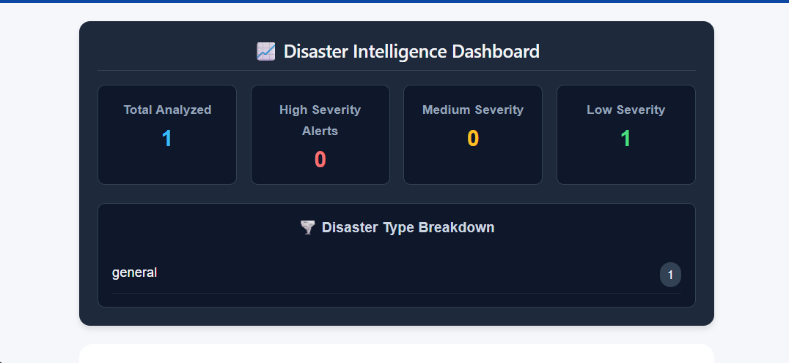

# 🌍 AI Disaster Management System

An AI-powered Disaster Management Assistant that helps users receive disaster-related guidance, real-time weather information, latest disaster news, and AI-generated responses using Retrieval-Augmented Generation (RAG).

The project combines **React**, **FastAPI**, **LangChain**, **Ollama**, **FAISS**, and external APIs to provide an intelligent disaster response system.

---

## 🚀 Features

- 🌊 Disaster Classification (Flood, Earthquake, Cyclone, Wildfire, Tsunami, Landslide)
- 🚨 Disaster Severity Detection
- 🤖 AI-Powered Disaster Assistance using Llama 3.2
- 📚 Retrieval-Augmented Generation (RAG)
- 🔍 Context-aware Question Answering
- 📄 Source Citation Display
- 🌦️ Real-Time Weather Information
- 📰 Latest Disaster News
- 🗺️ Interactive Location Map
- 🚑 Emergency Contact Information
- 📋 Copy AI Responses
- 💬 Chat-Based User Interface
- ⚡ FastAPI REST Backend
- 🎯 Responsive React Frontend

---

# 🏗️ System Architecture

```
                    User
                      │
                      ▼
          React Frontend (Chat UI)
                      │
                REST API Request
                      │
                      ▼
              FastAPI Backend
                      │
      ┌───────────────┼────────────────┐
      │               │                │
      ▼               ▼                ▼
Disaster         Weather API      News API
Classifier
      │
      ▼
 RAG Pipeline (LangChain)
      │
      ▼
FAISS Vector Database
      │
      ▼
 Ollama (Llama 3.2)
      │
      ▼
 AI Generated Response
```

---

# 🛠️ Tech Stack

## Frontend

- React.js
- Axios
- CSS3

## Backend

- FastAPI
- Python
- LangChain
- FAISS
- Requests

## AI & Machine Learning

- Ollama
- Llama 3.2
- Nomic Embed Text Embeddings
- Retrieval-Augmented Generation (RAG)

## APIs

- OpenWeather API
- NewsAPI

---

# 📂 Project Structure

```
AI-disaster-management
│
├── backend
│   ├── agents
│   ├── data
│   ├── chatbot.py
│   ├── rag.py
│   ├── weather.py
│   ├── news.py
│   ├── location_extractor.py
│   ├── router.py
│   ├── main.py
│   └── ...
│
├── frontend
│   ├── public
│   ├── src
│   │   ├── App.jsx
│   │   ├── App.css
│   │   ├── MapView.jsx
│   │   └── ...
│   ├── package.json
│   └── ...
│
└── README.md
```

---

# ⚙️ Installation

## Clone Repository

```bash
git clone https://github.com/STORMY432/AI-disaster-management.git

cd AI-disaster-management
```

---

## Backend Setup

```bash
cd backend

python -m venv .venv

# Windows
.venv\Scripts\activate

# Linux / Mac
source .venv/bin/activate

pip install -r requirements.txt

uvicorn main:app --reload
```

Backend runs on:

```
http://127.0.0.1:8000
```

---

## Frontend Setup

```bash
cd frontend

npm install

npm run dev
```

Frontend runs on:

```
http://localhost:5173
```

---

# 💬 Example Questions

- There is heavy rain in Kolkata. What should I do?
- What precautions should I take during an earthquake?
- Explain cyclone preparedness.
- What should I keep in a disaster emergency kit?
- What are the early warning signs of a tsunami?
- How do I stay safe during a wildfire?

---

# 📸 Screenshots

## 🏠 Home Screen



---

## 💬 AI Chat Response


        

---

## 🗺️ Interactive Map



---

## 📰 Latest Disaster News



---




# 🔮 Future Improvements

- 🌐 Multi-language Support
- 📷 Disaster Image Analysis
- 📄 PDF Report Generation
- 📍 Live GPS Location Detection
- ☁️ Cloud Deployment
- 📊 Disaster Analytics Dashboard
- 📱 Mobile Responsive Improvements

---

# 🎯 Learning Outcomes

This project demonstrates practical knowledge of:

- React.js
- FastAPI
- REST APIs
- LangChain
- Retrieval-Augmented Generation (RAG)
- Vector Databases (FAISS)
- Ollama Local LLM
- Prompt Engineering
- Weather & News API Integration
- AI-powered Chat Applications

---

# 👨‍💻 Author

**Sowroneel Bal**

GitHub:
https://github.com/STORMY432

---

# ⭐ Support

If you found this project useful, consider giving it a ⭐ on GitHub.